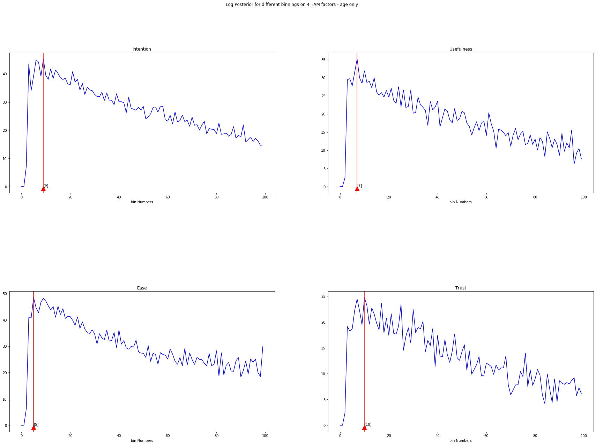
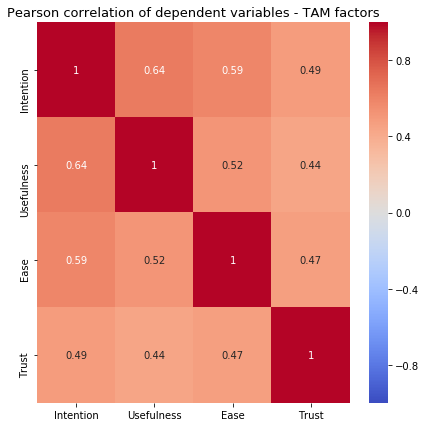
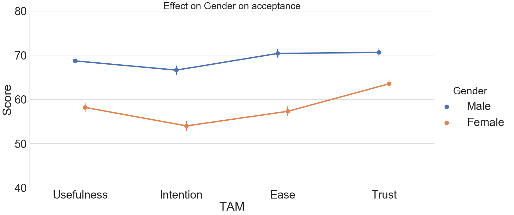
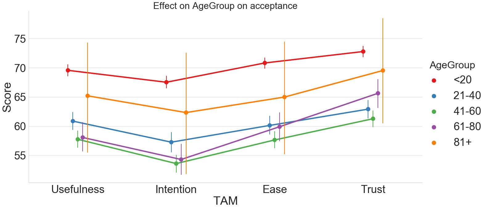
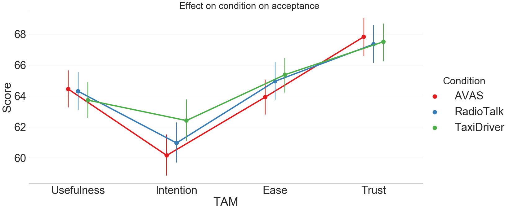
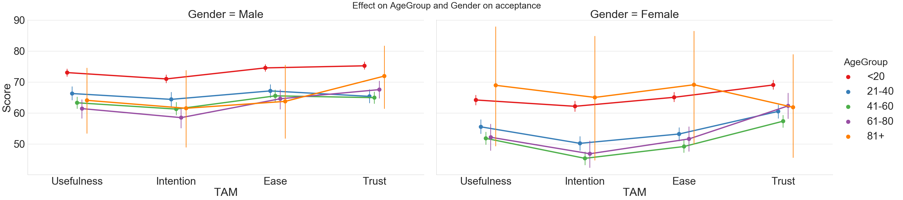

### Loading required python Modules


```python
import os
import pandas as pd
import seaborn as sns
import numpy as np
from IPython.display import display
from scipy import signal
from statsmodels.robust import scale
from statsmodels.multivariate.manova import MANOVA
from statsmodels.multivariate.multivariate_ols import _MultivariateOLS as mols
from scipy.special import gammaln
import matplotlib.pyplot as plt
```

### Defining Paths for data and plots


```python
# Base Data path
dataPath = './Data/'
# path for saving plots
plotsPath = './plots/'
# path to main dataset from MS-Wissenschaft setup (questionnaire answers)
MSW_CSV = 'msw-answers.csv'
# path to main dataset from German ministry of science and research (BMBF) setup (questionnaire answers)
BMBF_CSV = 'bmbf-answers.csv'
# path to name of headtracking data for extrakting condition of each participant for MS-Wissenschaft Setup
leftServerMswFile = 'MSW-left-files.csv'
rightServerMswFile = 'MSW-right-files.csv'
# path to name of headtracking data for extrakting condition of each participant for BMBF Setup
leftServerBmbfFile = 'bmbf-left-files.csv'
rightServerBmbfFile = 'bmbf-right-files.csv'
```

## MS-Wissenschaft analysis
The procedure will be exactly the same for both MS-Wissenschaft and BMBF therefore description will be only given for one dataset

### Reading Data


```python
#reading data to a dataframe
data = pd.read_csv(dataPath + MSW_CSV)
#reading headtracking data filenames frrom left side computer
leftServerFiles = pd.read_csv(dataPath + leftServerMswFile , header = None)
#reading headtracking data filenames frrom right side computer
rightServerFiles = pd.read_csv(dataPath + rightServerMswFile , header = None)
```

### create data frame for file names


```python
#convert filenames to pandas dataframe 
fileNames = pd.concat([leftServerFiles , rightServerFiles] , ignore_index = True)
#rename the columns
fileNames.columns = ['fileName']
#extract the coditions from filename
filename_df = fileNames.fileName.str.split('-' , expand = True)
#renaming the columns to uid and condition
filename_df['uid'] = filename_df[2].str.replace('.raw','')
filename_df['condition'] = filename_df[1]
#set index of filenames dataframe to uid
filename_df.set_index('uid', inplace = True)
#droping original unnamed and extra columns 
filename_df.drop(columns = [0,1,2] , inplace = True)
```

### Initial Cleanups


```python
# converting date time to pandas date time object
data['date'] = pd.to_datetime(data['date'] , infer_datetime_format = True)
#setting index to uid from dataset
data.set_index('uid' , inplace = True)
#droping database auto increament id column
data.drop(columns = ['id'] , inplace = True)
#filtering data to those after the beginning of the experiment (removing test data)
data = data.loc[ data.date > '2019-05-14']
#removing null genders
data = data.loc[ data.Sex != 'n' ]
#merging conditions from filenames dataframe to cleanedup dataframe on uid
finalData = data.merge(filename_df, left_on='uid' , right_on='uid', how='left', suffixes=('',''))
#renaming columns for easier use
finalData.rename(columns = {'Intention to Use 1': 'Intention' , 
                  'Perceived Usefulness 4': 'Usefulness' ,
                  'Perceived Ease of Use 2': 'Ease',
                  'Trust' : 'Trust',
                  'Driving Frequency':'Driving' ,
                  'Playing Hours':'Play',
                  'VR Playing Frequency':'VR',
                  'condition':'Condition',
                  'Sex':'Gender'} , inplace = True)
finalData.Gender = finalData.Gender.map({
    'männlich' : 'Male',
    'weiblich' : 'Female',
    'intersex' : 'intersex',
    'keine Angabe':'N/A'
})
finalData = finalData.query('Age != 0 and Age != 99 ')

```

### Check Distribution of conditions and drop NAs


```python
# check condition distribution 
print('Number of participants per condition:')
display(finalData.Condition.value_counts())
print("number of missing values per column:")
display(finalData.isna().sum())
print("proportion of missing values per column:")
display(finalData.isna().mean())
```

    Number of participants per condition:


    AVAS          2942
    TaxiDriver    2895
    RadioTalk     2762
    Name: Condition, dtype: int64


    number of missing values per column:


    date            0
    Intention       0
    Usefulness      0
    Ease            0
    Trust         302
    Gender          0
    Age             0
    Aviophobia      0
    Driving         0
    Play            0
    VR              0
    Condition       5
    dtype: int64


    proportion of missing values per column:


    date          0.000000
    Intention     0.000000
    Usefulness    0.000000
    Ease          0.000000
    Trust         0.035100
    Gender        0.000000
    Age           0.000000
    Aviophobia    0.000000
    Driving       0.000000
    Play          0.000000
    VR            0.000000
    Condition     0.000581
    dtype: float64


### Fix NA in answers (replace with zero)


```python
# fill empty trust column values with zero
finalData.Trust.fillna(finalData.Trust.median(), inplace = True)
print("number of missing values per column:")
display(finalData.isna().sum())
print("proportion of missing values per column:")
display(finalData.isna().mean())

```

    number of missing values per column:


    date          0
    Intention     0
    Usefulness    0
    Ease          0
    Trust         0
    Gender        0
    Age           0
    Aviophobia    0
    Driving       0
    Play          0
    VR            0
    Condition     5
    dtype: int64


    proportion of missing values per column:


    date          0.000000
    Intention     0.000000
    Usefulness    0.000000
    Ease          0.000000
    Trust         0.000000
    Gender        0.000000
    Age           0.000000
    Aviophobia    0.000000
    Driving       0.000000
    Play          0.000000
    VR            0.000000
    Condition     0.000581
    dtype: float64


### Remove remaning NAs


```python
# remove raws with NA condition
finalData.dropna(inplace = True)
print("number of missing values per column:")
display(finalData.isna().sum())
print("proportion of missing values per column:")
display(finalData.isna().mean())
```

    number of missing values per column:


    date          0
    Intention     0
    Usefulness    0
    Ease          0
    Trust         0
    Gender        0
    Age           0
    Aviophobia    0
    Driving       0
    Play          0
    VR            0
    Condition     0
    dtype: int64


    proportion of missing values per column:


    date          0.0
    Intention     0.0
    Usefulness    0.0
    Ease          0.0
    Trust         0.0
    Gender        0.0
    Age           0.0
    Aviophobia    0.0
    Driving       0.0
    Play          0.0
    VR            0.0
    Condition     0.0
    dtype: float64


### Printing particpant data and distribution of the data in each condition


```python
print('Number of participants in total:')
display(finalData.shape)
print('Number of participants per condition:')
display(finalData.Condition.value_counts())

```

    Number of participants in total:


    (8599, 12)


    Number of participants per condition:


    AVAS          2942
    TaxiDriver    2895
    RadioTalk     2762
    Name: Condition, dtype: int64


## OPTBIN
OPTBIN algorithm has been used only on MSW data to define age groups in a data driven manner

### Helper functions


```python
def find_bin_number(array):
    result = np.where(array == np.amax(array))
    return result[0]
```

### OPTBIN Implementation


```python
def OPTBIN(data, maxM):
    N = data.shape[0]
    logp = np.zeros(maxM)
    for M in range(1,maxM):
        n = np.histogram(data,M)
        part_one = N * np.log(M) + gammaln(M/2) - gammaln(N+M/2)
        part_two = -1 * M * gammaln(1/2) + sum(gammaln(n[0] + 0.5))
        logp[M] = part_one + part_two
    return logp
```

### Preparing data for OPTBIN


```python
df = (
    finalData
    .reset_index()
    .groupby(['Age'])
    .agg({'Usefulness':'mean','Intention':'mean','Ease':'mean','Trust':'mean' })
    .reset_index()    
)
```

### Running OPTBIN on the data


```python
plog_result = list()
for TAM in ['Intention','Usefulness','Ease','Trust']:
        plog_result.append(OPTBIN(df[TAM],100))
```

### Visualising OPTBIN results


```python
fig, axes = plt.subplots(nrows=2, ncols=2,figsize = (30,20))
fig.subplots_adjust(hspace=0.5)
fig.suptitle('Log Posterior for different binnings on 4 TAM factors - age only')
TAM = ['Intention','Usefulness','Ease','Trust']
fig.subplots_adjust(hspace=0.7)
optBinNumber = list(map(find_bin_number,plog_result))
i = 0
for ax, logp, name in zip(axes.flatten(), plog_result, TAM):
    ax.plot(logp, color='b')
    ax.set(title=name, xlabel='bin Numbers')
    ax.axvline(optBinNumber[i], color='r')
    ax.annotate(str(optBinNumber[i]), xy = (optBinNumber[i], 0), xytext = (optBinNumber[i], 0), arrowprops={'color': 'red'})
    i += 1
plt.savefig(plotsPath + 'OPTBIN/logp-age.png', dpi=300)
```





### Applying age groups


```python
finalData['AgeGroup'] = pd.cut(finalData.Age.values, bins=[0, 20, 40, 60, 80, 100], labels=['<20','21-40','41-60','61-80','81+'])
```

### Filtering gender to male and female only


```python
finalData = finalData.query('Gender == "Male" or Gender == "Female"')
```


```python
spssDf = finalData.drop(columns=['Age','Aviophobia','Play','VR','Driving','date'])
```


```python
spssDf.Gender = spssDf.Gender.map({
    'Male' : 0,
    'Female' : 1
})
spssDf.Condition = spssDf.Condition.map({
    'AVAS' : 0,
    'RadioTalk' : 1,
    'TaxiDriver': 2
})
spssDf.AgeGroup = spssDf.AgeGroup.map({
    '<20' : 0,
    '21-40' : 1,
    '41-60' : 2,
    '61-80' : 3,
    '81+' : 4
})
```


```python
spssDf.head()
```


<div>
<style scoped>
    .dataframe tbody tr th:only-of-type {
        vertical-align: middle;
    }

    .dataframe tbody tr th {
        vertical-align: top;
    }

    .dataframe thead th {
        text-align: right;
    }
</style>
<table border="1" class="dataframe">
  <thead>
    <tr style="text-align: right;">
      <th></th>
      <th>Intention</th>
      <th>Usefulness</th>
      <th>Ease</th>
      <th>Trust</th>
      <th>Gender</th>
      <th>Condition</th>
      <th>AgeGroup</th>
    </tr>
    <tr>
      <th>uid</th>
      <th></th>
      <th></th>
      <th></th>
      <th></th>
      <th></th>
      <th></th>
      <th></th>
    </tr>
  </thead>
  <tbody>
    <tr>
      <th>8598a83e2af441b8bcd0ae5d84beb875</th>
      <td>100</td>
      <td>0</td>
      <td>100</td>
      <td>75.0</td>
      <td>0</td>
      <td>1</td>
      <td>1</td>
    </tr>
    <tr>
      <th>42bac596059749b5b8e8e83ae61de9b4</th>
      <td>50</td>
      <td>34</td>
      <td>83</td>
      <td>75.0</td>
      <td>1</td>
      <td>2</td>
      <td>2</td>
    </tr>
    <tr>
      <th>586c107173344c59aa4f71e3573233f0</th>
      <td>2</td>
      <td>3</td>
      <td>1</td>
      <td>75.0</td>
      <td>1</td>
      <td>0</td>
      <td>1</td>
    </tr>
    <tr>
      <th>9cdd85098b0b4ad5ab2282a5ac371a5e</th>
      <td>19</td>
      <td>21</td>
      <td>50</td>
      <td>75.0</td>
      <td>1</td>
      <td>0</td>
      <td>1</td>
    </tr>
    <tr>
      <th>ff846d92c7e6471183595bd2678f29f6</th>
      <td>0</td>
      <td>0</td>
      <td>50</td>
      <td>75.0</td>
      <td>1</td>
      <td>0</td>
      <td>1</td>
    </tr>
  </tbody>
</table>
</div>


```python
spssDf.to_csv (dataPath + 'MSW-Spss.csv', index = False, header=True)
```

### Correlation matrix of dependent variables


```python
tempdf = finalData.drop(columns=['Age','Aviophobia','Play','VR','Driving','date'])
_ , ax = plt.subplots(figsize=(7,7))
sns.heatmap(tempdf.corr(),vmin=-1,vmax=1,ax=ax, cmap='coolwarm',annot=True)
plt.title('Pearson correlation of dependent variables - TAM factors', fontsize=13)
plt.savefig(plotsPath +'Correlations/TAM_correlation.png', quality = 1200)
```





### Descriptive statist


```python
tempdf.describe()
```


<div>
<style scoped>
    .dataframe tbody tr th:only-of-type {
        vertical-align: middle;
    }

    .dataframe tbody tr th {
        vertical-align: top;
    }

    .dataframe thead th {
        text-align: right;
    }
</style>
<table border="1" class="dataframe">
  <thead>
    <tr style="text-align: right;">
      <th></th>
      <th>Intention</th>
      <th>Usefulness</th>
      <th>Ease</th>
      <th>Trust</th>
    </tr>
  </thead>
  <tbody>
    <tr>
      <th>count</th>
      <td>8599.000000</td>
      <td>8599.000000</td>
      <td>8599.000000</td>
      <td>8599.000000</td>
    </tr>
    <tr>
      <th>mean</th>
      <td>60.822305</td>
      <td>63.580533</td>
      <td>64.447029</td>
      <td>66.560995</td>
    </tr>
    <tr>
      <th>std</th>
      <td>34.515630</td>
      <td>32.348532</td>
      <td>31.435116</td>
      <td>31.504604</td>
    </tr>
    <tr>
      <th>min</th>
      <td>0.000000</td>
      <td>0.000000</td>
      <td>0.000000</td>
      <td>0.000000</td>
    </tr>
    <tr>
      <th>25%</th>
      <td>32.000000</td>
      <td>50.000000</td>
      <td>50.000000</td>
      <td>49.000000</td>
    </tr>
    <tr>
      <th>50%</th>
      <td>66.000000</td>
      <td>70.000000</td>
      <td>70.000000</td>
      <td>75.000000</td>
    </tr>
    <tr>
      <th>75%</th>
      <td>100.000000</td>
      <td>97.000000</td>
      <td>99.000000</td>
      <td>100.000000</td>
    </tr>
    <tr>
      <th>max</th>
      <td>100.000000</td>
      <td>100.000000</td>
      <td>100.000000</td>
      <td>100.000000</td>
    </tr>
  </tbody>
</table>
</div>


### Running MANOVA


```python
maov = MANOVA.from_formula('''Intention + Usefulness + Ease + Trust
                            ~ C(AgeGroup) + C(Gender) + C(Condition) 
                            + C(AgeGroup):C(Gender)
                            ''', data=finalData)
```

### MANOVA summary


```python
print(maov.mv_test().summary())
```

                       Multivariate linear model
    ================================================================
                                                                    
    ----------------------------------------------------------------
           Intercept        Value  Num DF   Den DF   F Value  Pr > F
    ----------------------------------------------------------------
              Wilks' lambda 0.4819 4.0000 7835.0000 2106.2050 0.0000
             Pillai's trace 0.5181 4.0000 7835.0000 2106.2050 0.0000
     Hotelling-Lawley trace 1.0753 4.0000 7835.0000 2106.2050 0.0000
        Roy's greatest root 1.0753 4.0000 7835.0000 2106.2050 0.0000
    ----------------------------------------------------------------
                                                                    
    ----------------------------------------------------------------
          C(AgeGroup)       Value   Num DF   Den DF   F Value Pr > F
    ----------------------------------------------------------------
              Wilks' lambda 0.9693 16.0000 23936.9580 15.3224 0.0000
             Pillai's trace 0.0307 16.0000 31352.0000 15.1437 0.0000
     Hotelling-Lawley trace 0.0316 16.0000 15664.0010 15.4688 0.0000
        Roy's greatest root 0.0307  4.0000  7838.0000 60.2146 0.0000
    ----------------------------------------------------------------
                                                                    
    ----------------------------------------------------------------
             C(Gender)        Value  Num DF   Den DF  F Value Pr > F
    ----------------------------------------------------------------
                Wilks' lambda 0.9855 4.0000 7835.0000 28.9033 0.0000
               Pillai's trace 0.0145 4.0000 7835.0000 28.9033 0.0000
       Hotelling-Lawley trace 0.0148 4.0000 7835.0000 28.9033 0.0000
          Roy's greatest root 0.0148 4.0000 7835.0000 28.9033 0.0000
    ----------------------------------------------------------------
                                                                    
    ----------------------------------------------------------------
           C(Condition)      Value  Num DF   Den DF   F Value Pr > F
    ----------------------------------------------------------------
               Wilks' lambda 0.9974 8.0000 15670.0000  2.5420 0.0092
              Pillai's trace 0.0026 8.0000 15672.0000  2.5412 0.0092
      Hotelling-Lawley trace 0.0026 8.0000 11190.5309  2.5429 0.0092
         Roy's greatest root 0.0024 4.0000  7836.0000  4.6337 0.0010
    ----------------------------------------------------------------
                                                                    
    ----------------------------------------------------------------
     C(AgeGroup):C(Gender)  Value   Num DF   Den DF   F Value Pr > F
    ----------------------------------------------------------------
              Wilks' lambda 0.9950 16.0000 23936.9580  2.4450 0.0011
             Pillai's trace 0.0050 16.0000 31352.0000  2.4420 0.0011
     Hotelling-Lawley trace 0.0050 16.0000 15664.0010  2.4475 0.0010
        Roy's greatest root 0.0045  4.0000  7838.0000  8.7717 0.0000
    ================================================================
    


### LDA as post-hoc test for MANOVA


```python

```

### Visualising gender effect


```python
df = (
    finalData
    .reset_index()
    .groupby(['Condition', 'uid','AgeGroup', 'Gender'])
    .agg({'Usefulness':'mean','Intention':'mean','Ease':'mean','Trust':'mean' })
    .reset_index()    
)
df = pd.melt(df, id_vars=['Condition','AgeGroup', 'Gender'], value_vars=['Usefulness','Intention','Ease','Trust'], 
             var_name='TAM', value_name='Score')
```


```python
sns.set(context = "paper", style="whitegrid", font_scale=4, rc={'figure.figsize':(10,20)})
g = sns.catplot(data=df,x='TAM',y='Score',                   
                   hue='Gender',
                   kind = 'point',
                   dodge=0.1,
                   ci=95,
                   height=10,
                   aspect=2,
                   scale =2)
g = (
    g
    .set(yticks=np.arange(0,100,10), ylim=(40,80))
)
mean = df.loc[df['Gender'] == 'Male'].Score.mean()
#plt.axhline(mean, color='k', ls='--' ,lw=3)
#plt.annotate(str('{:.3f}').format(mean), xy = (0, mean - 10),fontsize='small')
plt.title('Effect on Gender on acceptance', fontsize=30)
plt.savefig(plotsPath +'Effects/TAM_by_gender.png', quality = 90)
```





### visualising effect of AgeGroups


```python
df = (
    finalData
    .reset_index()
    .groupby(['Condition', 'uid','AgeGroup', 'Gender'])
    .agg({'Usefulness':'mean','Intention':'mean','Ease':'mean','Trust':'mean' })
    .reset_index()    
)
df = pd.melt(df, id_vars=['Condition','AgeGroup', 'Gender'], value_vars=['Usefulness','Intention','Ease','Trust'], 
             var_name='TAM', value_name='Score')

```


```python
sns.set(context = "paper", style="whitegrid", palette="Set1", font_scale=4, rc={'figure.figsize':(10,20)})
g = sns.catplot(data=df,x='TAM',y='Score',
                   hue='AgeGroup',
                   
                   kind='point',
                   dodge=0.2,
                   ci=95,
                   height=10,
                   aspect=2,
                   scale = 2
                   )
mean = df.loc[df['AgeGroup'] == '<20'].Score.mean()
plt.title('Effect on AgeGroup on acceptance', fontsize=30)
plt.savefig(plotsPath +'Effects/TAM_by_age_group.png', quality = 90)
```





### visualising the effect of condition


```python
df = (
    finalData
    .reset_index()
    .groupby(['Condition', 'uid','AgeGroup', 'Gender'])
    .agg({'Usefulness':'mean','Intention':'mean','Ease':'mean','Trust':'mean' })
    .reset_index()    
)
df = pd.melt(df, id_vars=['Condition'], value_vars=['Usefulness','Intention','Ease','Trust'], 
             var_name='TAM', value_name='Score')

```


```python
sns.set(context = "paper", style="whitegrid", palette="Set1", font_scale=4, rc={'figure.figsize':(10,20)})
g = sns.catplot(data=df,x='TAM',y='Score',
                   hue='Condition',
                   kind='point',
                   dodge=0.2,
                   ci=95,
                   height=10,
                   aspect=2,
                   scale = 2
                   )
plt.suptitle('Effect on condition on acceptance', fontsize=30)
plt.savefig(plotsPath +'Effects/TAM_by_condition_1.png', quality = 90)
```





### Visualising AgeGroup and Gender interaction


```python
df = (
    finalData
    .reset_index()
    .groupby(['Condition', 'uid','AgeGroup', 'Gender'])
    .agg({'Usefulness':'mean','Intention':'mean','Ease':'mean','Trust':'mean' })
    .reset_index()    
)
df = pd.melt(df, id_vars=['Condition','AgeGroup', 'Gender'], value_vars=['Usefulness','Intention','Ease','Trust'], 
             var_name='TAM', value_name='Score')

```


```python
sns.set(context = "paper", style="whitegrid", palette="Set1", font_scale=4, rc={'figure.figsize':(10,20)})
g = sns.catplot(data=df,x='TAM',y='Score',
                   hue='AgeGroup',
                   col='Gender',
                   kind='point',
                   dodge=0.2,
                   ci=95,
                   height=10,
                   aspect=2,
                   scale = 2
                   )
mean = df.loc[df['AgeGroup'] == '<20'].Score.mean()
plt.suptitle('Effect on AgeGroup and Gender on acceptance', fontsize=30)
plt.savefig(plotsPath +'Effects/TAM_by_age_group_and_gender.png', quality = 90)
```




